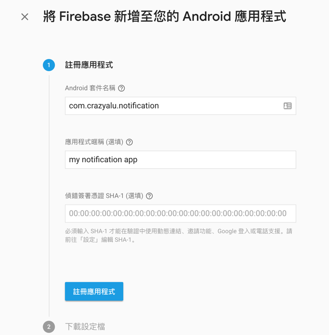

## 前言

在 Mobile App 的開發中，推播通知已經是不可或缺的 App 功能之一，大部分的商業 APP 都一定有推播通知的功能，因此，這次要介紹如何安裝與使用 Phonegap Plugin Push 並透過 Azure Notification Hub 實現 Android 與 iOS 的即時推播訊息功能。

## 什麼是 Phonegap-plugin-push?

Phonegap-plugin-push 提供使用**單一獨立的 API** 來支援接收及處理原生 push notification。但這不是指我們可以發送單一個訊息並在不同作業系統上都能收到。基本上 Android 使用的是 FCM，iOS 則使用 APNS，而且他們的 payload 都很不一樣。即使在 Android 及 iOS 都使用 FCM，也是需要提供不同的 payload 才能使套件正常運作。對 Android 來說，每一次的推播內容都會在 payload 存放 `data` 的物件，可以參考 [Notification vs Data Payload](https://github.com/phonegap/phonegap-plugin-push/blob/master/docs/PAYLOAD.md#notification-vs-data-payloads) 這篇文章。iOS 的話可以依照 [FCM documentation](https://firebase.google.com/docs/cloud-messaging/http-server-ref)。

筆者主要是透過 [Azure Notification Hub](https://docs.microsoft.com/zh-tw/azure/app-service-mobile/app-service-mobile-cordova-get-started-push) 發送推播訊息， Azure Notification Hub 同時提供了方便管理的介面，讓我們只需要透過一個通知中樞，並根據不同的平台提供不同的 payload 即可輕鬆的實現推播訊息通知的功能！

### 安裝需求

在安裝之前需要檢查一下對應的 Cordova 所支援的版本，若選擇的版本是較舊的 Cordova-Android 6.0.0 與  Cordova-iOS 4.3，則需要留意套件的版本要裝 1.9.0 的。

| Plugin version | Cordova CLI | Cordova Android | Cordova iOS | CocoaPods |
| -------------- | ----------- | --------------- | ----------- | --------- |
| 2.0.0          | 7.0.0       | 6.2.1           | 4.4.0       | 1.1.1     |
| 1.9.0          | 6.4.0       | 6.0.0           | 4.3.0       | 1.1.1     |
| 1.8.0          | 3.6.3       | 4.0.0           | 4.1.0       | N/A       |

<!--more-->

### 指令安裝

透過指令工具進行安裝：

```bash
$ cordova plugin add phonegap-plugin-push
```

安裝完成後可以看到 `config.xml` 出現如下的內容：

```xml
<plugin name="phonegap-plugin-push" spec="^2.1.2" />
```


## 建立 Azure 通知中樞

首先點選左上角建立資源，選擇 `Web + 行動` 的類別，可以看到 `Notification Hub`：


輸入 Notification Hub 相關資料，完成後點擊建立按鈕：


回到儀表板，可以看到剛建立好的通知中樞：


點擊通知中樞可以看到詳細資訊：


## 實作 Cordova App 接收推播通知功能

- Sample Code
  - Initialize PushNotification
  - WebAPI Post platform info and device token


#### 初始化設定

```typescript
  initNotification() {
    const senderID = environment.senderId;
    const pushConfig: PhonegapPluginPush.InitOptions = {
      android: {
        senderID: senderID
      },
      ios: { alert: true, badge: true, sound: true }
    };

    this.pushNotification = PushNotification.init(pushConfig);
	
    // 進行註冊
    this.pushNotification.on('registration', data => {
      // Get the native platform of the device.
      const platform = device.platform;
      // Get the handle returned during registration.
      const registId = data.registrationId;
      // Set the device-specific message template.
      if (platform === 'android' || platform === 'Android') {
        // Register for GCM notifications.
        this.handleData = { Platform: 'gcm', DeviceToken: registId };
      } else if (device.platform === 'iOS') {
        // Register for notifications.
        this.handleData = { Platform: 'apns', DeviceToken: registId };
      }
      console.log(`取得 token`, data.registrationId);
    });
	
    // 收到訊息時
    this.pushNotification.on('notification', data => {
      console.log(`got notification!`, data);
      // data.message,
      // data.title,
      // data.count,
      // data.sound,
      // data.image,
      // data.additionalData
    });
	
    // 發生錯誤時
    this.pushNotification.on('error', e => {
      console.log(`Notification Error: ${e.message}`, e);
    });
  }
```


#### 註冊裝置

```typescript
registDevice(): Observable<any> {
    // console.log(`進行推播註冊`, environment.serverUrl);
    // console.log(`device token`, this.handleData.DeviceToken);
    // console.log(`platform`, this.handleData.Platform);
    return this.http
      .post<any>(
        environment.apiUrl,
        this.handleData,
      )
      .pipe(
        catchError(err => {
          console.log(`notificationService registDevice error`, err);
          return Observable.throw(err);
        })
      );
  }
```


## Android 平台設定

### 建立 FCM Project

要推播訊息到 Android 系統，需要先建立 [FCM](https://console.firebase.google.com/) ( Firebase Cloud Message ) 專案，登入 Google 帳號後可以看到以下的畫面，點選新增專案：


然後輸入專案相關資訊：專案名稱、ID 及國家或地區，並點擊建立專案。


專案建立完成後，會進到專案的 dash board，點選左上角的齒輪展開選單，點擊`專案設定`：


點選後會看到專案的相關資訊，捲軸滾到下方可以看到目前專案中沒有任何應用程式，點擊中間將 Firebase 加入您的 Android 應用程式的選項：


點擊後進入新增 Android 應用程式的畫面，輸入 App 相關資訊，輸入完成後點擊註冊應用程式：



註冊完成之後，點選 下載 google-services.json` 按鈕進行下載，並將檔案存放在 Cordova 專案的根目錄。


下載完成之後再回到 Cordova 專案的 `config.xml` 設定檔，在 Android 的 `platform` 區塊中加上以下的內容：

```xml
 <platform name="android">
        <allow-intent href="market:*" />
        <resource-file src="google-services.json" target="app/google-services.json" />
</platform>
```

FCM 的部分設定完成後，我們還需要將 API Key 存放至 Azure Notification Hub 的設定中，因此回到專案的主控台，雖然在一般的分頁下可以看到 `網路 API 金鑰`，但這似乎還是舊版的，筆者在 Azure 輸入設定時會遇到錯誤的情況，因此新版的部分要點選 ` CLOUD MESSAGING` 標籤進入：


會看到專案憑證的資訊及寄件者 ID，而伺服器金鑰則是建立 Azure Notification Hub 之後要設定的 API Key：


進入 Googel ( GCM ) 的設定，並將複製的 API Key 貼上：


### Azure Notification Hub 測試推播

完成設定之後，可以到側欄下方有個`支援與疑難排解`的類別，底下有個 `Test Send` 連結，點選後會看到測試發送的畫面，確認 Cordova App 的 Device Token 有順利註冊成功後，選擇 Android 平台即可立即發送測試。


## 小結

經過以上的介紹我們可以知道要如何安裝 `phonegap-plugin-push` 並建立 FCM Project 後，將 `google-service.json` 加入 Cordova 專案中，同時將伺服器金鑰設定至 Azure Notification Hub 中，最後來一發測試訊息，大功告成！

Apple 的部分，由於需要另外建立推播服務的憑證，下篇文章會再針對 APNS 的部分去做說明，若沒接觸過 Apple Develope 後台，想實作推播功能的話，需要花點時間了解 Apple 的 App Identity 與憑證的建立方式，才能順利實作囉。