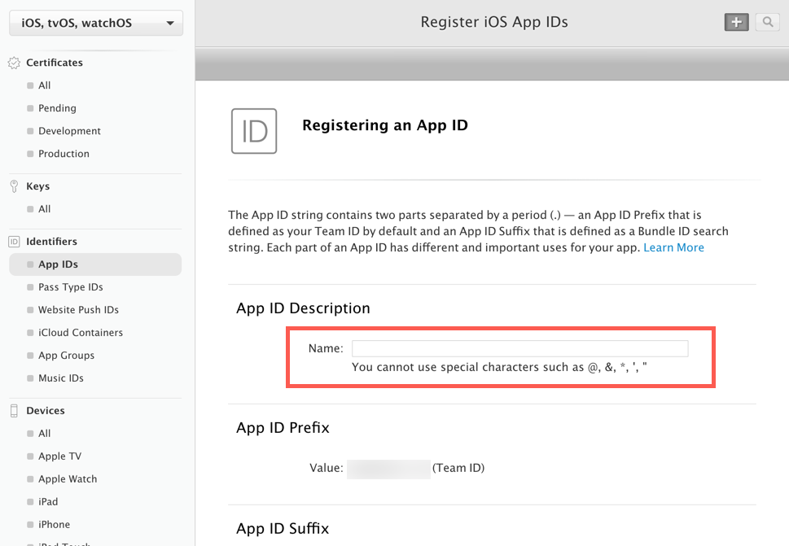
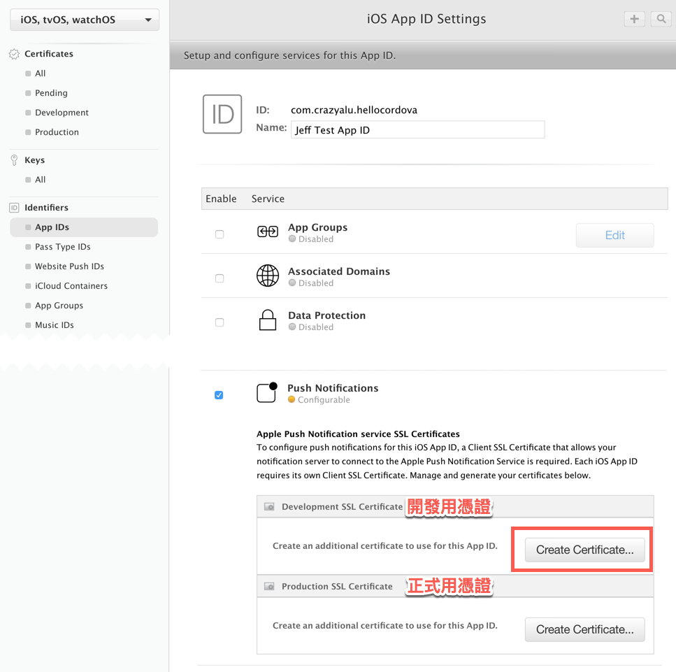

## 前言

上一篇我們介紹了如何建立 FCM 並將 API 金鑰設定至 Azure，最後完成訊息推播測試，本篇將繼續說明 iOS 訊息推播要如何設定，主要的步驟有：

1. 建立 iOS 推播通知憑證
2. 上傳 p12 與設定 Azure Notification Hub
3. 進行推播測試

## 建立 App Identity (App ID)

iOS 平台需要先進入 Apple Developer 的管理介面建立 `AppId`，並啟動 `Push Notifications` 的功能。另外，要準備一台 MacOS 裝置，透過鑰匙圈 ( Keychain ) 工具建立 CSR ( Certificate Signing Request )，將檔案上傳轉換成憑證並下載，點擊加入鑰匙圈後匯出 p12 檔，將 p12 檔上傳至 Azure Notification Hub 的 Apple 設定中。

<!--more-->





勾選完成後，點擊下方藍色的 `Continue` 按鈕繼續下一步：


完成 APP IDs 新增後，可以看到目前 App 的 `Push Notifications` 狀態為 `Configurable`，也就是待設定中，點擊下方的 `Edit` 進行設定。


點擊 `Edit` 按鈕後，可以看到關於此 App 的服務相關設定，將捲軸滾到 `Push Notifications` 的地方，並點擊 `Development SSL Certificate` 的 `Create Certificate` 按鈕建立憑證：



由於建立憑證需要上傳 CSR，因此在這之前，需要先透過鑰匙圈工具建立 CSR。

## 建立 CSR ( Certificate Signing Request )

首先在 MacOS 的裝置上開啟鑰匙圈存取 ( Keychain )：


功能選單點擊`鑰匙圈存取` =>`憑證輔助程式`=>`從憑證授權要求憑證`：


電子郵件地址建議輸入真實的位置，由於是自己本機產生的，不需要寄送電子郵件給 CA，因此選擇儲存到磁碟即可。


## 建立 APNS 憑證

回到 `Create Certificate` 之後的頁面，點擊最下方 `continue` 按鈕進入下一頁，並點擊 `Choose File` 上傳 CSR：


上傳完成後即可建立憑證，點擊 `Download` 下載憑證：


憑證下載完成之後，點擊兩下即可將憑證加入至鑰匙圈存取工具中，即可看到加入的憑證：


加入之後點擊右鍵選取輸出憑證：


輸入檔名後，點擊儲存：


設定 p12 檔的存取密碼，設定完成後即可完成輸出：


## 設定 Azure Notification Hub

最後一個步驟，在取得 p12 檔之後，需要上傳至 Azure Notification Hub，如此一來才能順利存取 APNS 的服務，並透過 Azure 通知中樞進行推播。

Apple 的 APNS 設定畫面，選擇上傳 `Certifiate` 的方式進行設定：


應用程式模式的部分，由於我們建立的是開發用的測試憑證，因此應用程式模式要選擇沙箱 ( Sandbox )，儲存之後即可完成通知中樞 Apple 平台的設定。

回到 Cordova 專案，輸入指令進行 iOS 建置：

```bash
$ cordova build ios
```

建置完成後到 Cordova 專案目錄下的 `platforms/ios` 路徑，開啟 `xcworkspace` 檔：


由於推播訊息的測試無法透過模擬器進行，因此需要一台實體的 iOS 裝置，並將裝置註冊到開發的管理後台，Xcode 提供了快速註冊的功能，當接上 iOS 裝置後選擇部署目標為實體裝置時，Xcode 會進行裝置的確認，若尚未註冊裝置則會出現錯誤的提示訊息，此時在 Signing 的部分會出現一個 `Register Device` 按鈕，點擊即可自動註冊。


選擇部署裝置後，點選 `Capabilities` 分頁，確認推播的服務是否有啟用：


部署到裝置上，點擊 `Push Init` 按鈕：


允許傳送通知後，即可完成推播功能初始化並取得註冊 token，然後點擊 `Registration` 將 token 傳到後端：


回到 Azure 通知中樞，進行測試傳送：


收到推播訊息囉！


## 小結

透過以上的介紹，我們可以知道如何建立 App ID，並且透過 MacOS 的鑰匙圈存取工具建立 CSR 檔案，將 CSR 上傳到 APNS 建立憑證，將憑證下載並加入鑰匙圈，然後匯出成 p12 檔，將 p12 檔上傳至 Azure 通知中樞設定，利用 Cordova build 指令部署到測試的實體裝置中，最後發送測試。